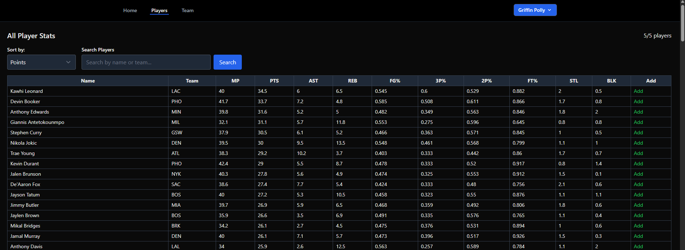
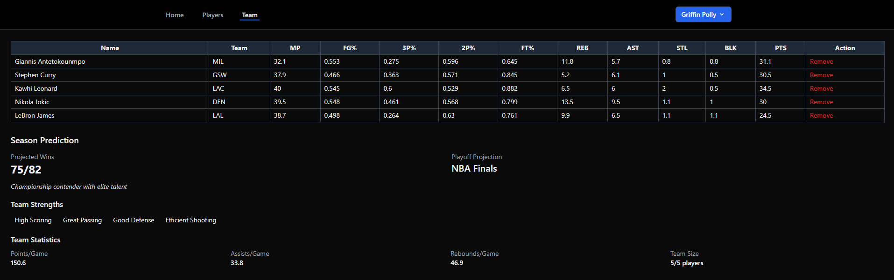

# Laravel Fantasy Basketball

A full-stack fantasy basketball web application that lets users browse real NBA player statistics, build a custom 5-player team, and simulate a predicted season outcome — all powered by local NBA data and a Laravel backend.

## Key Features

**Player Browser** — Browse the full NBA player database with sortable stats: minutes played, points, assists, rebounds, steals, blocks, and shooting percentages.
<br>Filter and sort the table by MP, PTS, or AST to find the best players for your roster.



**Team Builder** — Add up to 5 players to your personal team roster. Duplicate players are prevented, and players can be removed at any time.

**Season Prediction** — Once your roster is set, simulate a full season. The app calculates a base score from your team's combined stats (PTS × 0.6 + AST × 0.3 + TRB × 0.1), applies a randomness factor, and predicts your season result




**Player Management** — Add, edit, or delete players from the database directly through the UI.

**Accounts & Authentication** — Register and log in to save your team across sessions. Includes email verification, password reset, and profile management — secured with Laravel Breeze.

## Tech Stack

**Frontend:** Blade, Tailwind CSS, Alpine.js, Vite

**Backend:** Laravel 12, PHP 8.2+, SQLite

**Auth:** Laravel Breeze

**Data:** Local NBA stats CSV seeded into SQLite

## Getting Started

```bash
# Install dependencies
composer install && npm install

# Environment setup
cp .env.example .env
php artisan key:generate

# Database
touch database/database.sqlite
php artisan migrate

# Start development servers
composer run dev
```

The `composer run dev` command starts the Laravel server, Vite dev server, queue listener, and log viewer concurrently.

Open [http://localhost:8000](http://localhost:8000).
